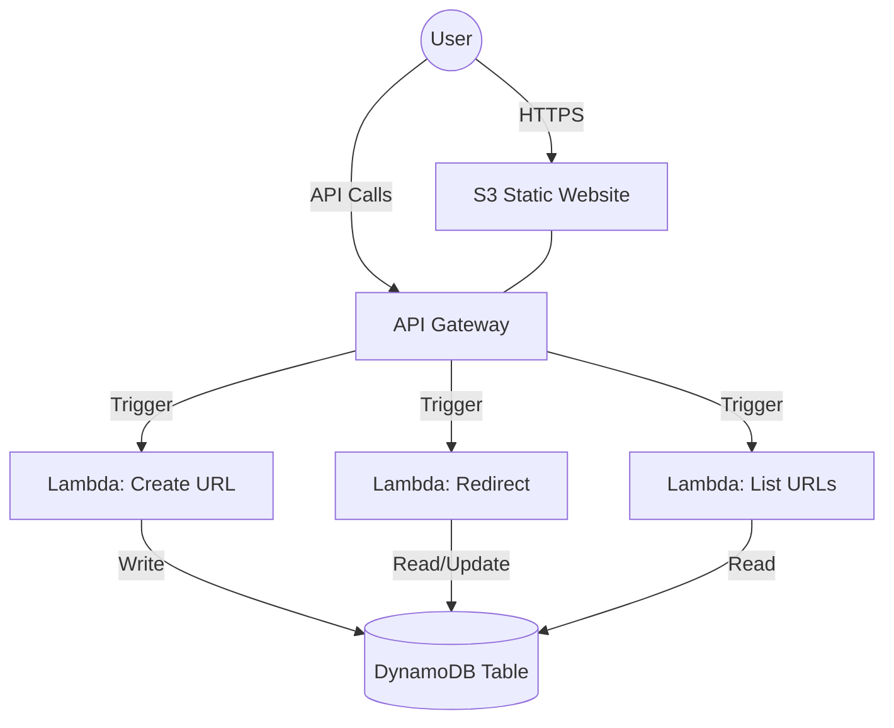

# 🚀 AWS Mastery: The Ultimate Zero-to-Hero Guide

Welcome to the **Complete AWS Hands-On Tutorial**. This repository is a meticulously crafted, step-by-step learning path designed to take you from an absolute beginner to building and deploying industry-level applications on Amazon Web Services—all while staying strictly within the **Free Tier**.

---

## 🌟 Why This Guide?

Most tutorials skip the "why" or the small "mouse-click" details. This guide is different:
- **Zero-Cost Policy:** Every single step is vetted for Free Tier eligibility.
- **Visual Learning:** Includes detailed UI navigation instructions ("Click here", "Select this").
- **Full-Stack Project:** You don't just learn services; you build a real-world application.
- **Windows Optimized:** Tailored for developers working on Windows laptops.

---

## 🗺️ The Learning Path

The course is divided into 7 comprehensive modules, moving from foundations to complex architectures.

| Module | Topic | Key Skills Acquired |
| :--- | :--- | :--- |
| [**Part 1**](./PART1_AWS_Foundations_and_Account_Setup.md) | **Foundations** | Regions vs AZs, IAM Security, MFA, Budgeting & Billing Alarms |
| [**Part 2**](./PART2_S3_Storage.md) | **S3 Storage** | Bucket Management, Static Site Hosting, Lifecycle Policies, Versioning |
| [**Part 3**](./PART3_VPC_Subnets_Networking.md) | **Networking** | VPC, Public/Private Subnets, Route Tables, Security Groups, NACLs |
| [**Part 4**](./PART4_EC2_Compute.md) | **EC2 & Linux** | Launching Servers, SSH KeyPairs, Shell Scripting, Software Installation |
| [**Part 5**](./PART5_Docker_and_ECR.md) | **Containerization** | Dockerizing Apps, Docker Compose, Elastic Container Registry (ECR) |
| [**Part 6**](./PART6_Lambda_and_Serverless.md) | **Serverless** | Function-as-a-Service (FaaS), API Gateway, Event-Driven Triggers |
| [**Part 7**](./PART7_Full_Project_and_Summary.md) | **Final Project** | Building a Production-Ready Serverless URL Shortener |

---

## 🏗️ Capstone Project: Serverless URL Shortener

In the final part, you will synthesize everything you've learned to build a highly scalable, serverless application.

### Architecture Diagram

**Features:**
- **Static Frontend:** Hosted on S3 with global accessibility.
- **Serverless Backend:** No servers to manage, scales automatically.
- **NoSQL Database:** High-performance storage using DynamoDB.
- **Zero Cost:** Runs entirely within the AWS Always Free limits.

---

## 🛠️ Prerequisites

Before you start, ensure you have:
- [ ] An active **AWS Free Tier Account**.
- [ ] A Windows 10/11 Laptop.
- [ ] **AWS CLI** installed and configured (covered in Part 1).
- [ ] A code editor like **VS Code**.
- [ ] Curiosity and a desire to build!

---

## ⚠️ Critical Safety Rules

1. **Billing First:** Never start a module without checking your Billing Dashboard.
2. **Clean as You Go:** Follow the **Cleanup** section at the end of every module.
3. **MFA is Mandatory:** Always enable Multi-Factor Authentication on your Root and Admin accounts.
4. **Elastic IP Warning:** Never leave an Elastic IP unattached—it will cost you money!

---

## 🎓 Learning Outcomes

By the end of this tutorial, you will be able to:
- Architect and deploy multi-tier networks in the cloud.
- Manage compute resources using both Virtual Machines (EC2) and Containers (Docker).
- Build modern, event-driven serverless architectures.
- Automate cloud infrastructure using the Command Line Interface (CLI).
- Host secure, globally available static websites.

---

## 🤝 Contribution & Support

Feel free to fork this repository, submit issues, or suggest improvements. If you found this helpful, give it a ⭐!

**Happy Learning with Chalaka 🎉**
*Cloud Computing is not just a skill, it's a superpower.*
